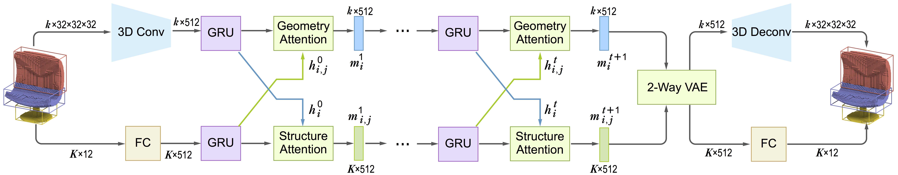

# SAGNet: Structure-aware Generative Network for 3D-Shape Modeling
by [Zhijie Wu](https://zhijiew94.github.io/), Xiang Wang, [Di Lin](https://vcc.tech/Di_Lin/), [Dani Lischinski](http://danix3d.droppages.com/), [Daniel Cohen-Or](http://www.math.tau.ac.il/~dcor/), [Hui Huang](https://vcc.tech/~huihuang)


## Project page
The project page is available at [https://vcc.tech/research/2019/SAGnet/](https://vcc.tech/research/2019/SAGnet/).


## Introduction ##
This repository contains an official implementation for [SAGNet: Structure-aware Generative Network for 3D-Shape Modeling](http://vcc.szu.edu.cn/file/upload_file//image/research/att201905040553/SAGNet.pdf). 
This model takes voxel maps as geometry and bounding boxes as structure and learn a latent space through a joint analysis.
The network is implemented with Python and [TensorFlow](https://www.tensorflow.org/).

To train the framework, you need CUDA-compatible GPUs. 
However, if you just want to generate 3D shapes, you may load the pretrained model trained on our own training data and follow the `Test Model` section. 
In addition, codes to visualize the synthesized results are also included.

If you have questions, please feel free to contact Zhijie Wu (wzj.micker@gmail.com).




## Starting ##

The current released codes are tested on Ubuntu 16.04. To train this network properly, please install the follow dependencies:
- Python 2.7.13
- CUDA 8.0
- Cudnn 6.0
- [TensorFlow v1.2.0](https://www.tensorflow.org/)
- [numpy](http://www.numpy.org/)
- [scipy](https://www.scipy.org/)
- [pyyaml](https://pypi.python.org/pypi/PyYAML) 
- [PyQt5 v5.6.0](https://pypi.org/project/PyQt5/)
- [qdarkstyle v2.3.1](https://github.com/ColinDuquesnoy/QDarkStyleSheet/)
- [VTK v5.10.1](https://vtk.org/)

The `PyQt5`, `qdarkstyle` and `VTK` packages are required for running the visualization application. All these python packasges can be easily found 
in the common package list of Python distributions. Note that, maybe the `VTK`, `PyQt` have to be 5.10.1 and 5.6.0 for better package compatibility.
We trained our model with tensorflow 1.2.0, but more advanced version should also work. 

Then you can do something to clone our repository.
```
git clone git@github.com:zhijieW-94/SAGNet.git
```


## Get training data ##
In this project, we segment some 3D shapes collected from [3D ShapeNetCore](http://web.stanford.edu/~ericyi/project_page/part_annotation/index.html) by ourselves.
There are five classes of objects, including airplane, chair, guitar, lamp and motorbike. 
To make our life easier, we compute corresponding voxel maps and bounding boxes for these 3D shapes as training data.

And we build a directory for each class of them. To receive a quick start, we should first unzip the file (`training_data.zip`) to `/data` and then we can see five directories.
```
cd data
unzip training_data.zip
```

## Train Model ##
In order to train a model to synthesize 3D shapes, we should set some essential information in the `TRAIN` section of `config.yml`.
```
TRAIN:
  BATCH_SIZE: 10  # mini batch size
  GPU_ID: [0,1,2,3] # the gpus for training
  ...
  ITER_NUM: 80000
  ...
  DIR_PATH: 'training_data/'
  RESULTS_DIRECTORY: 'nn_exp_results/reconstruction_results/'
  LOG_DIRECTORY: 'nn_exp_results/logs/'
  MODEL_DIRECTORY: 'nn_exp_results/models/'
  
  PRETRAINED_MODEL_PATH: 'trained_models/weights_17900.ckpt'
 
  SHAPE_NAME: 'chair'
```
Generally, the `config.yml` is written in `json` format and contain the following options.
- `BATCH_SIZE`: apply the batch size of `BATCH_SIZE` for network training.
- `GPU_ID`: a list for GPU ID. We use four GPUs (e.g. [0, 1, 2, 3]) for training by default.
- `ITER_NUM`: the total training iteration number.
- `DIR_PATH`: the directory to place all the training data. We set `/training_data` as the default directory.
- `RESULTS_DIRECTORY`: the directory to place the intermediate reconstructed results. We set `nn_exp_results/reconstruction_results/` as the default directory.
- `LOG_DIRECTORY`: the directory to place the intermediate log file. We set `nn_exp_results/logs/` as the default directory.
- `MODEL_DIRECTORY`: the directory to place the intermediate saved checkpoint file. We set `nn_exp_results/models/` as the default directory.
- `PRETRAINED_MODEL_PATH`: the path to a pretrained model file for further finetuning (e.g. `trained_models/weights_17900.ckpt`).
- `SHAPE_NAME`: synthesize shapes for the class `SHAPE_NAME`. We currently support five classes (`airplane`, `chair`, `guitar`, `lamp`, and `motorbike`). 

After the `config.yml` has been set well, then we directly run `train_net.py` to start model training as:
```
python train_net.py
```
During training, we can monitor if the model is trained well or not with the help of log file and the reconstruction results.
When the training goes well, we can see a directory named `shapename_timestamp` will be created in `RESULTS_DIRECTORY`, `MODEL_DIRECTORY` and `LOG_DIRECTORY` respectively. The frequencis are determined by `SNAPSHOT_FREQ` and `SUMMARY_FREQ` options.


## Test Model ##
Before synthesizing 3D shapes with the trained model, we should set the `config.yml` as:
```
TEST:
  GPU_ID: [7] # the gpus for testing

  RESULTS_DIRECTORY: 'nn_exp_results/testing_results/'
  PRETRAINED_MODEL_PATH: 'trained_models/weights_67999.ckpt'

  SAMPLE_SIZE: 10
```
In the `TEST` section, this file (`config.yml`) has the following options:
- `GPU_ID`: indicate which gpu should be used for testing.
- `RESULTS_DIRECTORY`: the directory to store the generation results.
- `PRETRAINED_MODEL_PATH`: the path to place the pretrained model, which will be used for generation.
- `SAMPLE_SIZE`: set the number of generated shapes to `SAMPLE_SIZE`.

If everything is OK, a `model_info.txt` will be included in the directory that stores corresponding pretrained model.
And the model info file is used to indicate which class the generated shapes belong to and some other essential information for shape synthesis.
Then you can directly run the `test_net.py` to synthesize `SAMPLE_SIZE` shapes as:
```
python test_net.py
```
Finally, the model will create `SAMPLE_SIZE` 3D shapes in `RESULTS_DIRECTORY` and each shape corresponds to a sub-directory named by a number.
In each sub-directory, there are several `.mat` and `.txt` files to represent the voxel maps and bounding boxes. 


## Visualize Results ##
We also provide a tool to visualize the training data or the generated shapes. Note that, both the training
data and results are composed of voxel maps and bounding boxes. You can run the visualization application as:
```
cd Visualization
python application.py
```
With the provided tool, you can visualize a group of results or a single shape. 
For example, to visualize all the `motorbike` training data, you should click the `Open` button and choose the `data/motorbike` directory (by default).
And when you aim to visualize a single motor shape (e.g. named `1d8fb258aac4175a5834749a5ef37100`), just click `Openone` button and choose the `data/motorbike/1d8fb258aac4175a5834749a5ef37100` directory.


## Checkpoints ##
Checkpoint files of the final model trained over all five classes are provided.
Please download them [here](https://drive.google.com/file/d/1rRAwlPE9pORn7r77VjK_H4iw-TCfNUXX/view?usp=sharing) and then paste the path of the unzipped checkpoint file (`.cptk`) to the `PRETRAINED_MODEL_PATH` option.


## Cite ##
If you use our code/model/data, please cite our paper:
```
@article{SAGnet19,
title = {SAGNet: Structure-aware Generative Network for 3D-Shape Modeling},
author = {Zhijie Wu and Xiang Wang and Di Lin and Dani Lischinski and Daniel Cohen-Or and Hui Huang},
journal = {ACM Transactions on Graphics (Proceedings of SIGGRAPH 2019)},
volume = {38},
number = {4},
pages = {91:1--91:14},  
year = {2019},
} 
```

## License ##
MIT License
